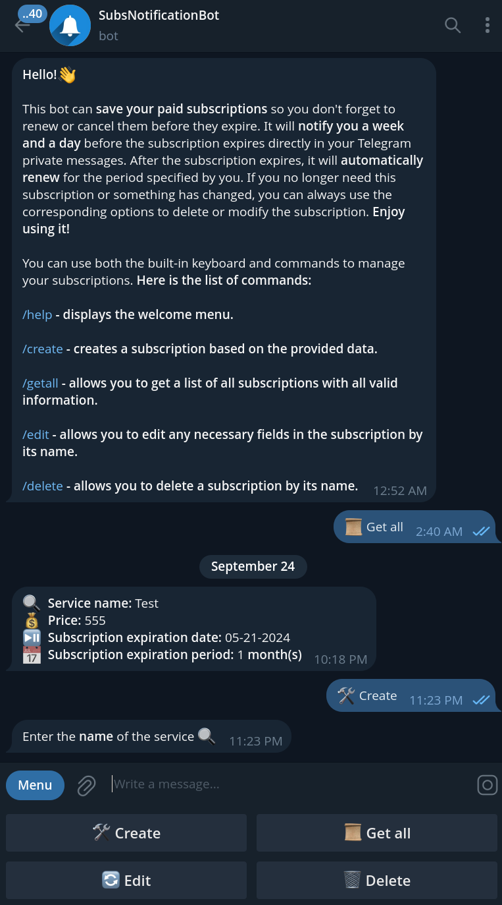

# Subscription Notification Bot

A custom bot developed using Node.js and TypeScript to notify users about expiring paid subscriptions via private messages on Telegram. This bot utilizes Long-Pooling technology and the Grammy.js library.

### Active example is accessible via Telegram: @SubsNotificationBot



## Table of Contents

1. [Tech Stack](#tech-stack)
2. [Project structure](#project-structure)
3. [Installation](#installation)
4. [Usage](#usage)

## Tech Stack

- **Language:** TypeScript
- **Runtime:** Node.js
- **Bot Framework:** Grammy.js
- **Dependency Injection:** InversifyJS
- **Database:** PostgreSQL
- **ORM:** Prisma

## Project structure

```bash
src
├── commands/        # command handlers
│   └── conversations/  # conversation-specific handlers
├── dto/             # DTO schemas for data validation
├── helpers/         # utilities and configurations
│   ├── constants/   # constants for keyboards and commands
│   ├── inversify/   # dependency injection configuration
│   ├── keyboards/   # keyboard generators
│   └── *.ts         # helper utilities and configs
├── repository/      # data access layer (repositories)
├── scheduled/       # scheduled/cron jobs
├── services/        # business logic layer
└── main.ts          # application entry point
```

## Installation

### 1. Clone the repository:

```bash
git clone https://github.com/artiomsopin/subs-notification-bot
cd subs-notification-bot
```

### 2. Install dependencies:

```bash
npm install
```

### 3. Set up the environment variables:

1.  Copy the example environment file:

```bash
cp .env.example .env
```

2.  Fill in the required environment variables.

---

### 4. Run the database migrations:

```bash
npx prisma migrate dev
```

## Usage

### To start the bot, run:

```bash
npm run start:dev
```

### Available Commands

/help — displays the welcome menu.

/create — creates a subscription based on the provided data.

/getall — returns a list of all subscriptions with all valid information.

/edit — allows editing any necessary fields in the subscription by its name.

/delete — deletes a subscription by its name.
